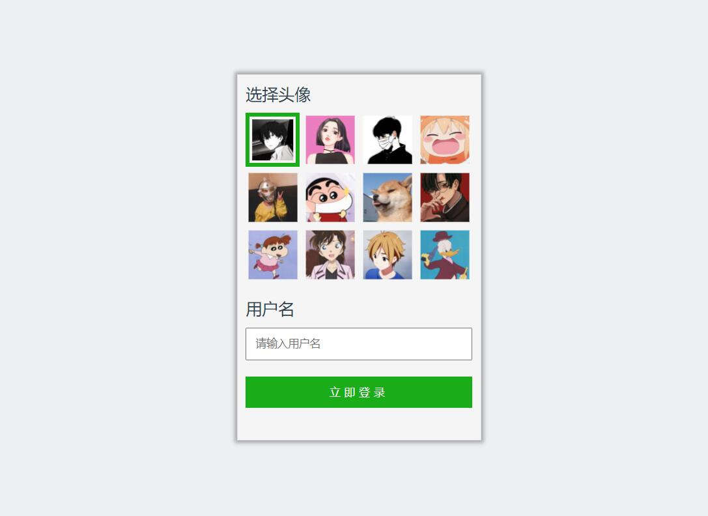
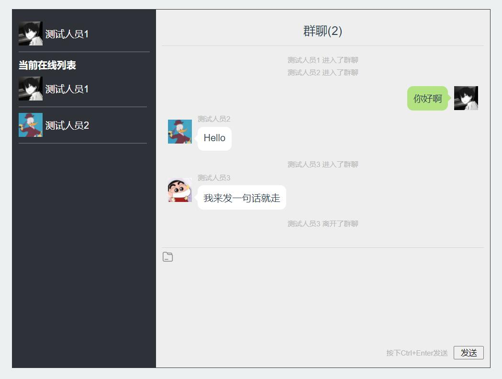
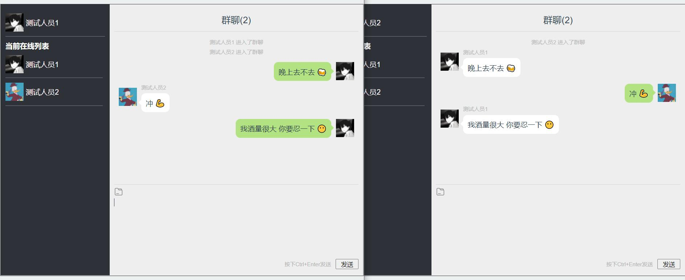

# 仿微信风格的在线聊天室
>一款仿微信风格的在线聊天室。这是我个人练练手的小项目，前端部分使用Vue2，后端部分使用Nodejs编写。包括登录、实时显示在线用户列表、用户进出聊天室提示、实时文字聊天等功能。

>注：暂不支持图片等非文本格式文件传输，后续可能会加入。

## 技术栈
+ Vue + VueRouter
+ NodeJS
+ WebSocket (nodejs-websocket)

## 运行截图
+ 登录页面

+ 登录错误提示

+ 聊天室页面

+ 

## 运行项目
    # 克隆项目到本地
    git clone https://github.com/MrRainbowYoo/Chat_Room.git

    # 进入项目文件夹
    cd Chat_Room

    # 安装依赖
    npm install

    # 后端启动
    cd src/server
    npm install
    node server.js

    # 前端启动
    npm run serve

## 结语
本项目仅供个人学习研究使用，禁止用于商业或非法用途。

麻烦路过的朋友们随手点个Star~